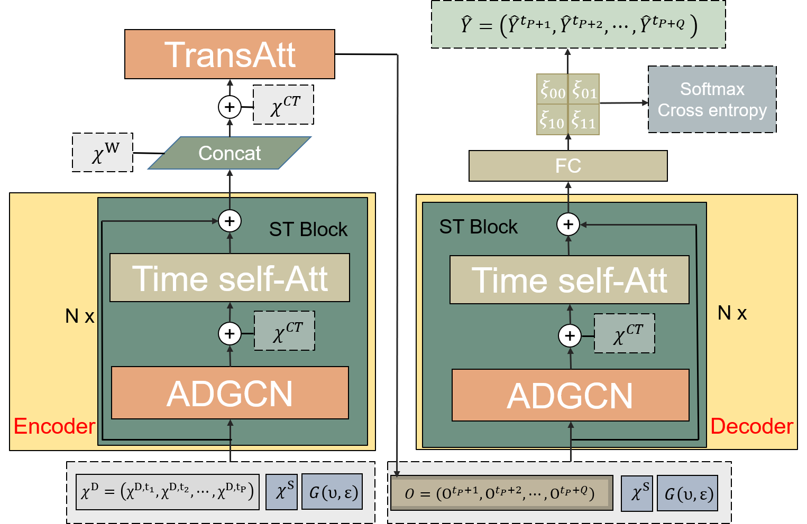

# MADGCN: Multi Attention Dynamic Graph Convolution Network with A Cost Sensitive Learning for Fine-Grained TRaffic Accident Prediction



## Requirements
- scipy>=0.19.0
- numpy>=1.12.1
- pandas>=0.19.2
- pyaml
- statsmodels
- tensorflow>=1.3.0
- pytorch>=2.4


Dependency can be installed using the following command:
```bash
pip install -r requirements.txt
```

## Data Preparation
The traffic data files for  Bay Area (PEMS-BAY), i.e.,`pems-bay.zip`, are available at [Baidu Yun](https://pan.baidu.com/s/1MhBe_DPWer2ah02UW_MIJA) and  the password is 'hfkn', and should be
put into the `data/` folder.
The `pems-bay.npz` files store the traffic data.While the `accident.npy` files store the accident data. 

### Metric for different horizons and datasets
The following table summarizes the performance of MADGCN on two dataset with regards to different metrics.

| Dataset  | Metric | 15min | 30min | 60min |
|----------|--------|-------|-------|-------|
|   NYC    | P    | 82.98  | 79.45  | 75.65  |
|          | R    | 90.53 | 86.34 | 81.87 |
|          | F1   | 86.59  | 82.75  | 78.64   |
|          | AUC  | 84.36  | 81.45  | 77.64  |
| PEMS-BAY | P    | 75.63 | 72.83 | 71.82|
|          | R    | 81.24  | 77.25  | 73.68  |
|          | F1   | 78.33  | 74.97  | 72.74   |
|          | AUC  | 75.97  | 71.75  | 67.13  |